# Cifar 10

Supervised Learning vs Self-Supervised Learning

## Self Supervised Learning Rotation

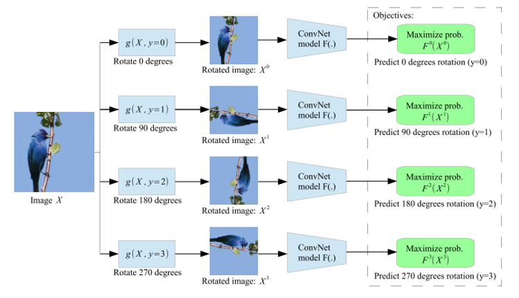
[*Unsupervised representation learning by predicting image rotations*](https://arxiv.org/pdf/1803.07728.pdf)

## Same settings.

```python
device = 'cuda:0' if torch.cuda.is_available() else 'cpu'
config = {
    'batch_size': 512,
    'base_lr': 1e-3,
    'num_epochs': 30,
    'valid_ratio': 0.1,
    'seed': 1213,
    'device': device
}
optimizer = optim.AdamW(model.parameters(), lr=base_lr, weight_decay=1e-4)
scheduler = CosineAnnealingWarmupRestarts(optimizer,
                                          first_cycle_steps=num_epochs,
                                          cycle_mult=1.0,
                                          max_lr=base_lr,
                                          min_lr=1e-8,
                                          warmup_steps=0,
                                          gamma=0.5)
criterion = LabelSmoothingLoss(num_classes, smoothing=0.5)
```

Criterion

* CrossEntropy
* SmmothingCrossEntropy +2%

## Model

### Shallow Model

```python
class NaiveNetwork(BaseNetwork):
    def __init__(self, num_classes=10):
        super().__init__()
        self.conv = nn.Sequential(nn.Conv2d(in_channels=3, out_channels=8, kernel_size=(5, 5)), Swish(),
                                  nn.Conv2d(in_channels=8, out_channels=16, kernel_size=(5, 5)), Swish(),
                                  nn.MaxPool2d(kernel_size=2, stride=2),
                                  nn.Conv2d(in_channels=16, out_channels=32, kernel_size=(3, 3)), Swish(),
                                  nn.Conv2d(in_channels=32, out_channels=32, kernel_size=(3, 3)), Swish(),
                                  nn.MaxPool2d(kernel_size=2, stride=2)
                                  )
        self.dropout = nn.Dropout(p=0.3)
        self.fc = nn.Linear(512, num_classes)
```

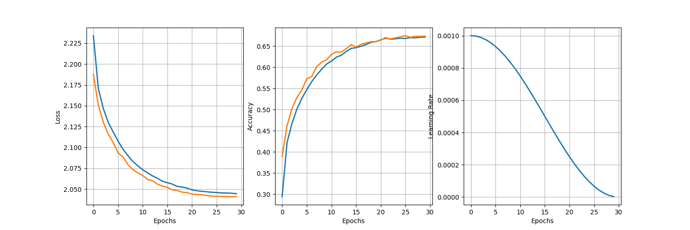
Supervised Learing *Test Acc: 67%*
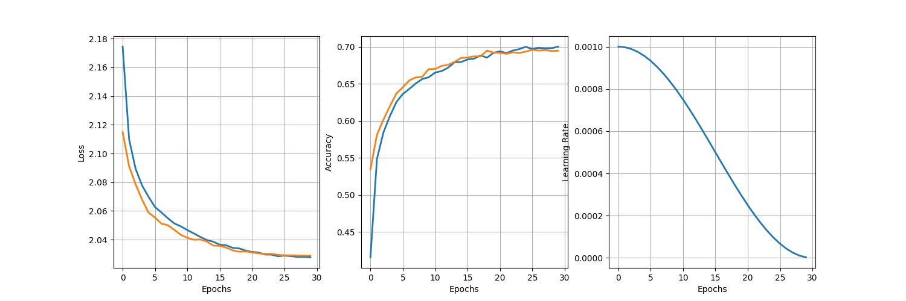
Self Supervised Learning *Test Acc: 69%*

### Using Resnet Structure Model

```python
class NaiveResidualNetwork(BaseNetwork):
    def __init__(self, features, num_blocks, num_classes=10):
        super().__init__()
        self.in_channels = 64
        self.conv1 = nn.Sequential(
            nn.Conv2d(3, 64, kernel_size=5, stride=2, padding=1, bias=False),
            nn.BatchNorm2d(64),
            Swish(),
            nn.MaxPool2d(kernel_size=3, stride=2, padding=1)
        )
        self.conv_list = nn.ModuleList(
            [self.make_layer(f, n, 1 if i == 0 else 2) for i, (f, n) in enumerate(zip(features, num_blocks))])
        self.avg_pool = nn.AdaptiveAvgPool2d((1, 1))
        self.dropout = nn.Dropout(p=0.3)
        self.fc = nn.Linear(features[-1], num_classes)
```

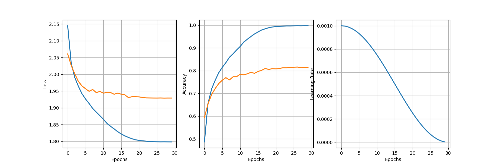
Supervised Learing *Test Acc: 81%*
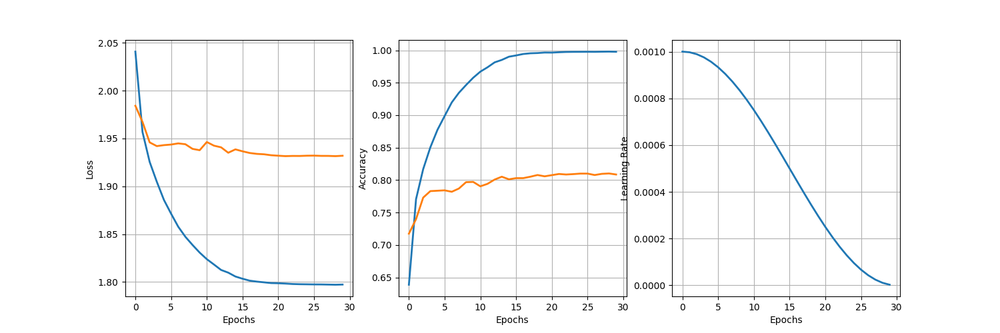
Self Supervised Learning *Test Acc: 81.5%*

### Pretrained Model

* Resnet 18
  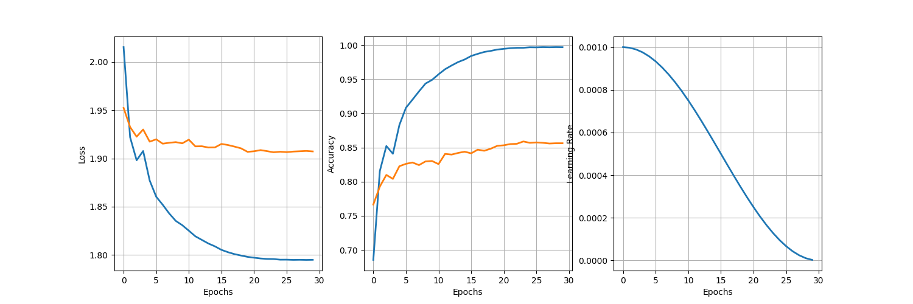
  Supervised Learing *Test Acc: 85.8%*
  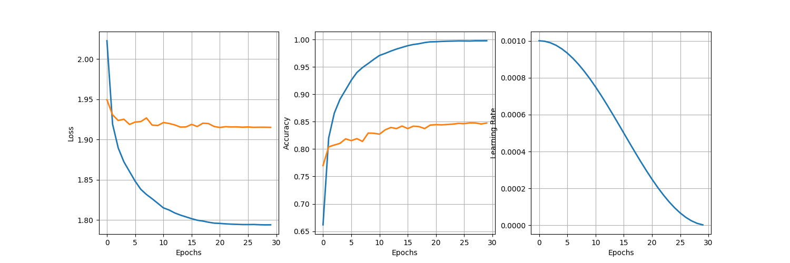
  Self Supervised Learning *Test Acc: 84.2%*
* Resnet 50
  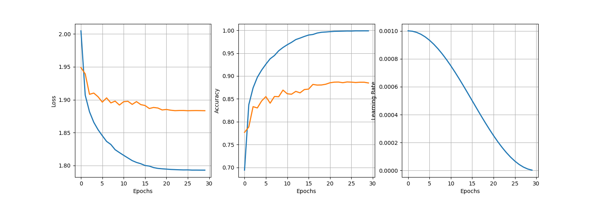
  Supervised Learing *Test Acc: 88.7%*
  
  Self Supervised Learning *Test Acc: 87.9%*

## Visualization CAM

* Shallow Model
  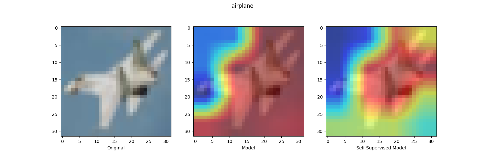
* Resnet structures Model
  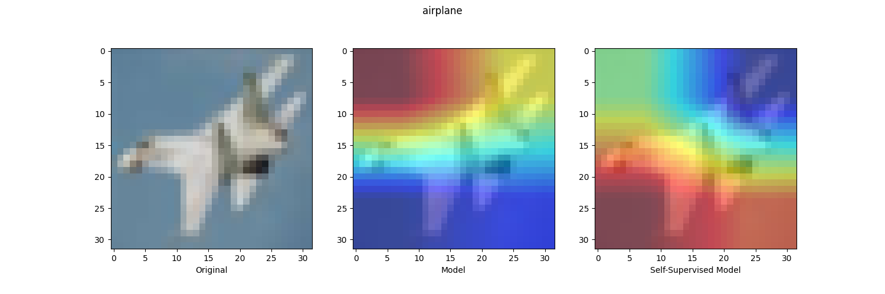
* Resnet 18
  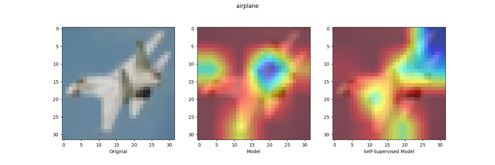
* Resnet 50
  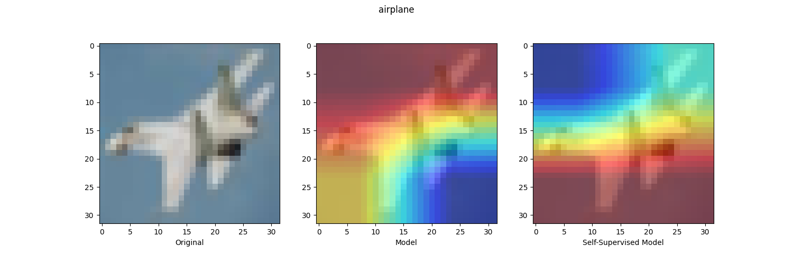
